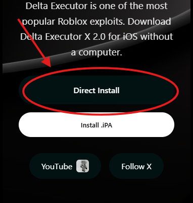

# Getting Started

[IOSでの入れ方](#1)  
[Androidでの入れ方](#2)  
[PC(windows)での入れ方](#3)    
[PC(MAC)での入れ方](#3)    

---

### IOSでの入れ方
::: tip Note
最終更新 2025/4/09
:::

1.[Delta](https://deltaios-executor.com/)を開いてDirectInstallを押します

>Installされない場合    
>discordで聞いてください   
::: tip taskが出た場合
3つとも押して、待つ。
::: 

2. 開きます
::: tip 信頼されていないエンタープライズデベロッパー みたいな表示が出た場合
1. 設定を開く    
2. 一般→VPNとデバイス管理へ行く  
3. Shenzhen SXT Software Co.,Ltd.を押す  
4. 「Shenzhen SXT Software Co.,Ltd.を信頼」を押したらスマホに表示される手順に従う。  
:::

3. 使いたいゲームに入ります。画像のようなポップアップが出たら、画像の通りに押します

4. そしたらリンクがコピーされるので、それをブラウザで開きます。  

5. Keyを取得します。     
::: tip 方法
Delta Ios Keysystemが出たらContinueを押して     
別のサイトに飛ばされます、そのサイトで手順通りにしたら進みます      
それを2回繰り返して終わったら、    
Create Keyを押してkeyを作成します。     
:::
::: warning 飛ばされたサイトでウイルスに感染しましたというのが出たら。
基本的に99.9%偽警告です、閉じでコピーしたリンクから、また開きなおしてください。
:::
6. 3の手順をして出てきたポップアップに画像の通りにします。
    
7. そしたら実行したいscriptをコピーしてきて、画像の通りにします。

8. そうすれば、使いたいscriptが使えます!。
::: tip Note何も表示されない場合。      
[チートを使っても効果が出ない / 機能しない](/faq/#faq-5)        
">_"このようなのを押してRobloxそのスクショをdiscordに張ることを推奨します。
:::
---

### Androidでの入れ方
::: tip Note
最終更新 2025/4/09
:::

1. [Delta](https://deltaexploits.gg/delta-executor-mobile)を開いて、画像の通りにdownloadする

::: tip Delta-665.684.apkがない
delta-xxx.xxx.apkとついているものを開いてください。
:::

::: tip セキュリティーの理由から、お使いのスマートフォンでは現在...みたいなのが出たら
[提供元不明のアプリを入れる方法は？](/faq/#faq-10)を参照してください。
:::
::: tip パッケージの破損または別の要因でインストールできない場合。
一旦Robloxをアンインストールしてから試してください。
:::
2. Robloxを開く、使いたいゲームに入る。     
::: tip Robloxのバージョンが古いと言われて起動できない場合
Deltaアップデートを待ちましょう。
:::
3. 画像のようなポップアップが出たら、画像の通りに押します
     

4. そしたらリンクがコピーされるので、それをブラウザで開きます。    

5. Keyを取得します。     
::: tip 方法
Delta Android Keysystemが出たらContinueを押して     
別のサイトに飛ばされます、そのサイトで手順通りにしたら進みます      
それを2回繰り返して終わったら、    
Create Keyを押してkeyを作成します。     
:::
::: warning 飛ばされたサイトでウイルスに感染しましたというのが出たら。
基本的に99.9%偽警告です、閉じでコピーしたリンクから、また開きなおしてください。
:::
6. 2の手順をして出てきたポップアップに画像の通りにします。
    
7. そしたら実行したいscriptをコピーしてきて、画像の通りにします。

8. そうすれば、使いたいscriptが使えます!。
::: tip Note何も表示されない場合。      
[チートを使っても効果が出ない / 機能しない](/faq/#faq-5)        
">_"このようなのを押してRobloxそのスクショをdiscordに張ることを推奨します。
:::